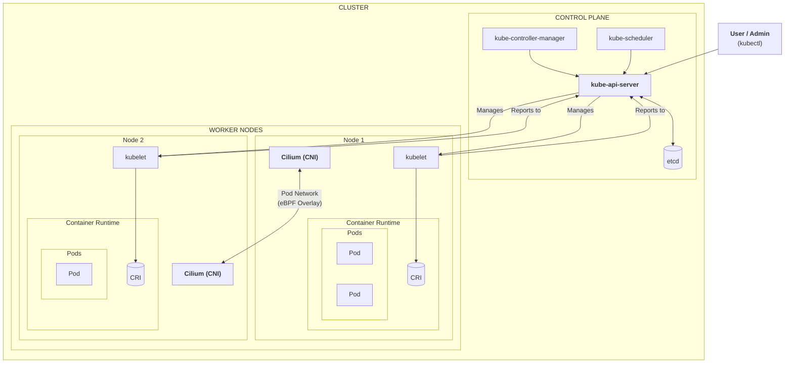

# lab-cluster-infra

研究室のオンプレミス Kubernetes クラスタを構築・管理するための Ansible リポジトリです。

## 概要

このリポジトリに含まれる Ansible Playbook は、Ubuntu 22.04 サーバー上に Kubernetes クラスタを構築します。OS の基本設定から、コンテナランタイム、Kubernetes コンポーネント、CNI プラグイン（Cilium）のデプロイまでを自動化します。

SSH の接続情報も Ansible プロジェクト内で管理しているため、リポジトリをクローンし、いくつかの設定を行うだけで、誰でも同じように Playbook を実行できる自己完結した構成を目指しています。

| レイヤー                  | 責務                                                                | ツール                         | lab-cluster での役割 |
| ------------------------- | ------------------------------------------------------------------- | ------------------------------ | -------------------- |
| L1: インフラ層            | 物理サーバー、VM、ネットワーク、OS の設定                           | Ansible                        | lab-cluster-infra    |
| L2: K8s クラスタ層        | Kubernetes コンポーネントのインストール、ノードの参加               | Ansible (kubeadm), Cluster API | lab-cluster-infra    |
| L3: K8s アドオン/アプリ層 | 監視ツール、Ingress、そしてユーザーアプリケーションのデプロイ・管理 | Argo CD (GitOps)         | lab-cluster-app      |

## アーキテクチャ

このリポジトリの Ansible Playbook によって構築される Kubernetes クラスタのアーキテクチャ図です。オンプレミス環境を想定しており、CNI には [Cilium](https://cilium.io/) を採用しています。



## 使用技術

このインフラを構成する主要なソフトウェアとバージョンは以下の通りです。

| カテゴリ              | コンポーネント | バージョン / 備考                                          |
| :-------------------- | :------------- | :--------------------------------------------------------- |
| **OS**                | Ubuntu         | 22.04 LTS                                                  |
| **IaC**               | Ansible        | 2.18.x                                                     |
| **Orchestration**     | Kubernetes     | 1.33.x （`roles/k8s-node-common/defaults/main.yml`で指定） |
| **Container Runtime** | containerd     | 1.7.x                                                      |
| **CNI**               | Cilium         | 1.16.x (kube-proxy 代替モード)                             |
| **CLI Tools**         | Helm           | 3.x                                                        |

## 動作環境

この Playbook を実行するコントロールノード（実行 PC）には、以下の環境が必要です。

- macOS
- Git
- Python 3.9 以上
- Homebrew （setup.sh スクリプト内でインストールを試みます）

## 1. 初期設定

新しいメンバーがこのリポジトリを使ってクラスタを管理するための最初の手順です。

### 1.1. Git リポジトリをクローン

```bash
git clone https://github.com/gen-yuu/lab-cluster-infra.git
cd lab-cluster-infra
```

### 1.2. セットアップスクリプトの実行 (macOS)

macOS 上で必要なツール（`ansible`, `helm`, `kubectl`など）と Python 仮想環境（`.venv`）をセットアップします

```bash
# スクリプトに実行権限を付与（初回のみ）
chmod +x setup.sh
# スクリプトを実行
./setup.sh
```

完了後、指示に従って仮想環境を有効化してください。

```bash
source .venv/bin/activate
```

### 1.3. インベントリファイルの編集

`inventory/inventory.ini`を編集し、構築対象サーバーの情報を記述します。このファイルに全ての接続情報が集約されています。
`inventory/inventory.ini` の記述例:

```ini
# --- ホスト定義 ---
[k8s_control_plane]
k8s-master ansible_host=192.168.xxx.xxx

[k8s_worker]
k8s-worker-1 ansible_host=192.168.xxx.xxx
k8s-worker-2 ansible_host=192.168.xxx.xxx

# --- グループ定義 ---
[k8s_cluster:children]
k8s_control_plane
k8s_worker

# --- 変数定義 ---
[k8s_worker:vars]
# k8s-master を踏み台サーバーとして経由する設定
ansible_ssh_common_args='-o ProxyJump=k8s-master'

[k8s_cluster:vars]
ansible_user=srv-admin
# 各自が使用するSSH秘密鍵のパスに変更
ansible_ssh_private_key_file=~/.ssh/id_ed25519
ansible_python_interpreter=/usr/bin/python3
```

### 1.4. クラスター変数の設定

`inventory/group_vars/k8s_cluster.yml` を編集し、クラスター固有の変数を設定します。

`inventory/group_vars/k8s_cluster.yml` の設定例:

```yml
# このクラスタのAPIサーバーエンドポイント (通常はプライマリマスターのIP)
k8s_api_endpoint: "192.168.xxx.xxx:6443"

# Kubernetesのネットワーク設定
k8s_pod_network_cidr: "10.244.0.0/16"
k8s_service_cidr: "10.96.0.0/12"
```

## 2. Playbook の実行

仮想環境を有効化した状態で実行してください。

### 2.1. ドライラン（事前チェック）

```bash
ansible-playbook --check --diff playbook-setup-cluster.yml
```

### 2.2. クラスタの構築

ドライランで問題がなければ、Playbook を実行してクラスタを構築します。

```bash
ansible-playbook playbook-setup-cluster.yml
```

## 3. 運用ガイド

### 新しい管理者の追加方法

新しいメンバーにサーバーへの SSH アクセス権（srv-admin ユーザーとして）を付与する手順です。

1. 公開鍵の入手 \
   新しい管理者となるメンバーに、自身の PC で作成した SSH 公開鍵（通常は ~/.ssh/id_rsa.pub など）の提出を依頼します。
2. 公開鍵ファイルの配置 \
   提出された公開鍵の文字列を、`[メンバー名].pub` のような分かりやすいファイル名で、以下のディレクトリに保存します。

```bash
roles/user-management/files/public_keys/
```

3. Playbook の実行
   以下のコマンドを実行し、追加した公開鍵を全てのサーバーにデプロイします。--tags を使うことで、ユーザー管理に関連するタスクのみが実行されます．
   ```bash
   ansible-playbook --tags user_management playbook-setup-cluster.yml
   ```
4. 完了の通知
   作業完了後、新しい管理者に srv-admin ユーザーとしてサーバーに SSH アクセスできるようになったことを伝えます。

### 新規ノードの追加

inventory.ini に新しいノードを追加した後、--limit オプションを使ってそのノードだけを対象に Playbook を実行するのが効率的です．

```bash
# 新規ワーカーノード `k8s-worker-3` だけをセットアップ
ansible-playbook --limit k8s-worker3 playbook-setup-cluster.yml
```

## プロジェクトの構造

主要なファイルとディレクトリの役割は以下の通りです．

```bash
.
├── Brewfile              # macOS用の依存ツールリスト (Homebrew)
├── LICENSE
├── README.md             # This file
├── ansible.cfg           # プロジェクト固有のAnsible設定ファイル
├── collections/
│   └── requirements.yml # Ansibleコレクションの依存関係リスト
├── inventory/
│   ├── group_vars/      # グループごとの変数を定義するディレクトリ
│   │   └── k8s_cluster.yml
│   └── inventory.ini      # 管理対象サーバーのリスト（ホストとグループ）
├── playbook-setup-cluster.yml # クラスタ全体を構築するメインのPlaybook
├── requirements.txt      # Pythonパッケージの依存関係リスト (pip)
├── roles/                  # 各機能の役割（Role）ごとのタスクを格納するメインディレクトリ
│   ├── base-os-setup/    # OSの基本設定を行うロール
│   ├── k8s-control-plane/ # マスターノード（コントロールプレーン）の構築を行うロール
│   ├── k8s-node-common/  # 全Kubernetesノード共通の設定を行うロール
│   ├── k8s-worker/       # ワーカーノードの構築を行うロール
│   └── user-management/  # 管理ユーザー(srv-admin)の作成やSSH鍵の管理を行うロール
└── setup.sh              # macOS用の開発環境セットアップスクリプト
```

#### `ansible.cfg`

このプロジェクトで `ansible-playbook` を実行する際の、デフォルトの動作を定義します。インベントリの場所、SSH 接続の最適化、権限昇格のデフォルト設定などが含まれており、コマンド実行をシンプルにします。

#### `inventory/`

- **`inventory.ini`**: 管理対象となるサーバーの IP アドレスやグループ分け、SSH 接続情報などを定義する、インフラ構成の核となるファイルです。
- **`group_vars/`**: `inventory.ini` で定義したグループに対して、適用したい変数（例: `k8s_cluster` グループ全体の API サーバーエンドポイントなど）を YAML 形式で定義します。

#### `playbook-setup-cluster.yml`

このプロジェクトのメインエントリーポイントです。`roles/` に定義された各役割を、正しい順序で呼び出し、クラスタ全体の構築プロセスをオーケストレーションします。

#### `roles/`

Ansible の処理内容を、機能的な役割ごとに分割して格納する中心的なディレクトリです。例えば、「OS の初期設定」「Kubernetes 共通設定」「マスター設定」といった形で責務が分離されており、コードの再利用性やメンテナンス性を高めています。

#### `setup.sh`, `Brewfile`, `requirements.txt`

新しい管理者が macOS 上で開発環境を整えるためのファイル群です。`setup.sh` を実行するだけで、Ansible の実行に必要な全てのツールとライブラリがセットアップされます。

## 開発・デバッグ用コマンド

### 静的解析 (ansible-lint):

Playbook がベストプラクティスに沿っているかを確認します。

```bash
ansible-lint playbook-setup-cluster.yml
```

### 構文チェック (--syntax-check):

YAML の構文や Ansible の基本的な記述に間違いがないかを高速にチェックします。

```bash
ansible-playbook --syntax-check playbook-setup-cluster.yml
```

## TODO

- [ ] Ansible Vault による機密情報の暗号化（データサーバの分離のため）
- [ ] ファクトキャッシュの有効化によるパフォーマンス向上
- [ ] ノードのクリーンアップ用ロール (`k8s-cleanup`) の作成
- [ ] バックアップとリストア用のロール作成
- [ ] GPU サーバー用のロール（NVIDIA ドライバ等）の作成
- [ ] UFW などを用いたセキュリティロールの作成
- [ ] 高可用性（HA）コントロールプレーンへの対応

## ライセンス

[LICENSE](https://github.com/gen-yuu/lab-cluster-infra/LICENSE) を参照してください。

## 著者

[gen-yuu](https://github.com/gen-yuu)
